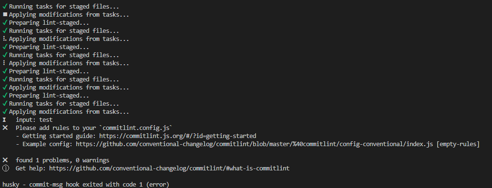
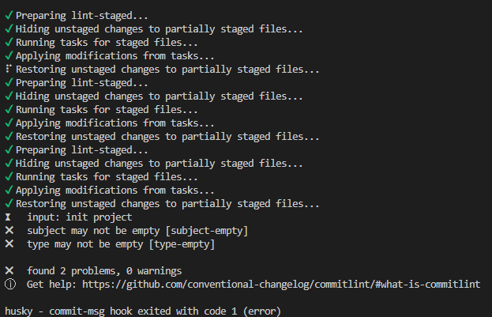

# 写在前面
- 本项目是关于web开发规范的一个demo，包括提交前ts、react语法检测；提交时message格式检测；提交后changelog记录。
- 项目使用lerna + yarn workspace进行多包和依赖管理。使用Eslint代码检查工具和prettier代码风格工具，使用husky工具操作pre-commit和commit-msg钩子函数对提交代码前的代码规范和commit的内容规范进行检测，使用changelog工具记录每一次commit。


## 安装依赖
### 全局安装 lerna
```sh
npm i lerna -g
```
### 全局安装 yarn

```sh
npm i yarn -g
```
### 安装项目依赖

```sh
yarn && yarn bootstrap
```
### 安装eslint
```sh
npm i eslint -D
npx eslint --init #初始化 自动生成 .eslintrc.js
```
### 安装prettier
```sh
npm i prettier eslint-config-prettier eslint-plugin-prettier -D
```
- 之后在.eslintrc 中,extend中添加 "prettier" 解决 eslint 和 prettier 的冲突


### 安装代码校验依赖
```sh
npm i lint-staged husky -D
npm set-script prepare "husky install" # 在package.json中添加脚本
npm run prepare # 初始化husky,将 git hooks 钩子交由husky执行
```
```sh
npx husky add .husky/pre-commit "npx lint-staged" #pre-commit 执行 npx lint-staged 指令
```
- 根目录创建 .lintstagedrc.json 文件控制检查和操作方式
```js
{
    "*.{js,jsx,ts,tsx}": ["prettier --write .", "eslint  --fix"],
    "*.md": ["prettier --write"]
}
```
### 安装提交信息依赖
```sh
npm i commitlint -D
```
- 根目录创建 commitlint.config.js
```js
module.exports = {
  parserPreset: "conventional-changelog-conventionalcommits",
  rules: {
    "body-leading-blank": [1, "always"],
    "body-max-line-length": [2, "always", 100],
    "footer-leading-blank": [1, "always"],
    "footer-max-line-length": [2, "always", 100],
    "header-max-length": [2, "always", 100],
    "subject-case": [
      2,
      "never",
      ["sentence-case", "start-case", "pascal-case", "upper-case"],
    ],
    "subject-empty": [2, "never"],
    "subject-full-stop": [2, "never", "."],
    "type-case": [2, "always", "lower-case"],
    "type-empty": [2, "never"],
    "type-enum": [
      2,
      "always",
      [
        "build",
        "chore",
        "ci",
        "docs",
        "feat",
        "fix",
        "perf",
        "refactor",
        "revert",
        "style",
        "test",
      ],
    ],
  },
  prompt: {
    questions: {
      type: {
        description: "Select the type of change that you're committing",
        enum: {
          feat: {
            description: "A new feature",
            title: "Features",
            emoji: "✨",
          },
          fix: {
            description: "A bug fix",
            title: "Bug Fixes",
            emoji: "🐛",
          },
          docs: {
            description: "Documentation only changes",
            title: "Documentation",
            emoji: "📚",
          },
          style: {
            description:
              "Changes that do not affect the meaning of the code (white-space, formatting, missing semi-colons, etc)",
            title: "Styles",
            emoji: "💎",
          },
          refactor: {
            description:
              "A code change that neither fixes a bug nor adds a feature",
            title: "Code Refactoring",
            emoji: "📦",
          },
          perf: {
            description: "A code change that improves performance",
            title: "Performance Improvements",
            emoji: "🚀",
          },
          test: {
            description: "Adding missing tests or correcting existing tests",
            title: "Tests",
            emoji: "🚨",
          },
          build: {
            description:
              "Changes that affect the build system or external dependencies (example scopes: gulp, broccoli, npm)",
            title: "Builds",
            emoji: "🛠",
          },
          ci: {
            description:
              "Changes to our CI configuration files and scripts (example scopes: Travis, Circle, BrowserStack, SauceLabs)",
            title: "Continuous Integrations",
            emoji: "⚙️",
          },
          chore: {
            description: "Other changes that don't modify src or test files",
            title: "Chores",
            emoji: "♻️",
          },
          revert: {
            description: "Reverts a previous commit",
            title: "Reverts",
            emoji: "🗑",
          },
        },
      },
      scope: {
        description:
          "What is the scope of this change (e.g. component or file name)",
      },
      subject: {
        description:
          "Write a short, imperative tense description of the change",
      },
      body: {
        description: "Provide a longer description of the change",
      },
      isBreaking: {
        description: "Are there any breaking changes?",
      },
      breakingBody: {
        description:
          "A BREAKING CHANGE commit requires a body. Please enter a longer description of the commit itself",
      },
      breaking: {
        description: "Describe the breaking changes",
      },
      isIssueAffected: {
        description: "Does this change affect any open issues?",
      },
      issuesBody: {
        description:
          "If issues are closed, the commit requires a body. Please enter a longer description of the commit itself",
      },
      issues: {
        description: 'Add issue references (e.g. "fix #123", "re #123".)',
      },
    },
  },
};
```
### 安装辅助提交依赖
```sh
npm i git-cz  -D
npm set-script cz "cz"
```
- 在package.json中添加如下代码
```sh
"config": {
    "commitizen": {
      "path": "git-cz"
    }
  },
```
### 安装changelog
```sh
npm i cz-conventional-changelog conventional-changelog -D
npm set-script changelog "conventional-changelog -p angular -i CHANGELOG.md -s -r 0"
```
- 根目录创建 changelog.config.js
```js
const fs = require("fs");
const path = require("path");

const files = fs.readdirSync(path.resolve(__dirname, "./packages"));

const scopes = files
  .filter((item) => !item.startsWith("."))
  .concat("workspace");

module.exports = {
  disableEmoji: false,
  format: "{type}{scope}: {emoji}{subject}",
  list: [
    "test",
    "feat",
    "fix",
    "chore",
    "docs",
    "refactor",
    "style",
    "ci",
    "perf",
  ],
  effects: scopes,
  maxMessageLength: 64,
  minMessageLength: 3,
  questions: [
    "type",
    "scope",
    "subject",
    "body",
    "breaking",
    "issues",
    "lerna",
  ],
  scopes: scopes,
  types: {
    chore: {
      description: "Build process or auxiliary tool changes",
      emoji: "🤖",
      value: "chore",
    },
    ci: {
      description: "CI related changes",
      emoji: "🎡",
      value: "ci",
    },
    docs: {
      description: "Documentation only changes",
      emoji: "✏️",
      value: "docs",
    },
    feat: {
      description: "A new feature",
      emoji: "🎸",
      value: "feat",
    },
    fix: {
      description: "A bug fix",
      emoji: "🐛",
      value: "fix",
    },
    perf: {
      description: "A code change that improves performance",
      emoji: "⚡️",
      value: "perf",
    },
    refactor: {
      description: "A code change that neither fixes a bug or adds a feature",
      emoji: "💡",
      value: "refactor",
    },
    release: {
      description: "Create a release commit",
      emoji: "🏹",
      value: "release",
    },
    style: {
      description: "Markup, white-space, formatting, missing semi-colons...",
      emoji: "💄",
      value: "style",
    },
    test: {
      description: "Adding missing tests",
      emoji: "💍",
      value: "test",
    },
  },
};
```
- 根目录创建changelog.js
```js
const fs = require('fs')
const path = require('path')
const readline = require('readline')
const os = require('os')

const isExists = async (filePath) => {
  return await fs.promises
    .access(filePath)
    .then(() => true)
    .catch(() => false)
}
// const __dirname = path.resolve();
const filePath = path.resolve(__dirname, 'CHANGELOG.md')

// let projectName = "";

const args = process.argv.slice(2)
args.forEach(async (projectName) => {
  const outputFilePath = path.resolve(__dirname, 'packages', projectName)
  if (!(await isExists(outputFilePath))) {
    console.log('项目不存在, 请重新输入：', projectName)
  } else {
    const readLine = readline.createInterface({
      input: fs.createReadStream(filePath),
    })

    const outputFileName = path.resolve(outputFilePath, 'CHANGELOG.MD')
    const writeStream = fs.createWriteStream(outputFileName)

    readLine.on('line', (line) => {
      line = line.trim()
      // 去除issue
      line = line.replace(/\(\[.*?\]\(.*?\)\)$/, '')
      if (line.match(/^\*\s\*\*.*?:\*\*/)) {
        // 包含对应的项目
        if (line.includes(`**${projectName}:**`)) {
          writeStream.write(line + os.EOL)
        }
      } else if (line.match(/^\*\s/)) {
        if (line.includes(`* ${projectName}`)) {
          writeStream.write(line + os.EOL)
        }
      } else {
        writeStream.write(line + os.EOL)
      }
    })
  }
})
```
## 代码提交
- 通过 git-cz 提交代码，根据选项选择 scope 和影响范围

```sh
git add .
npm run cz
git push
```

- 如果没有创建并配置commintlint


- 如果commit的message不符合commintlint.config.js规范（没有使用cz辅助工具），则提交会被拦截。

 
- 通过 以下命令生成全部项目 changelog(记录 feat 和 fix 的 commit 记录)
  ```sh
  $ npm run changelog
  ```
- 执行上面命令后，执行如下命令生成对应项目的 changelog，如下代码可生成 A 项目的 changelog
  ```sh
  $ node changelog.js A
  ```


